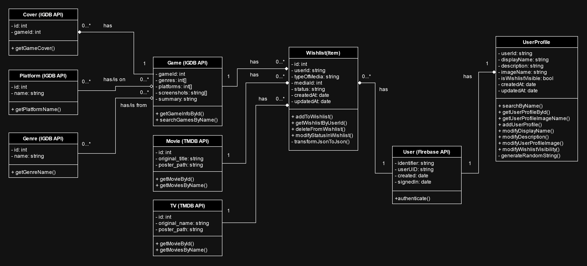
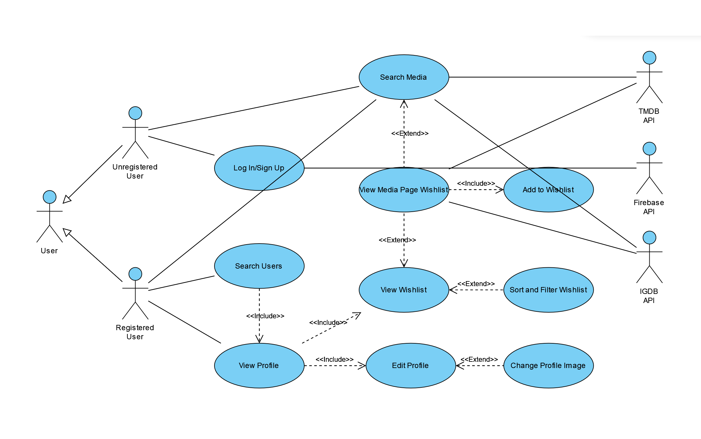

# WishlistApp

## Prezentarea proiectului
Proiectul constă într-o aplicație mobilă care permite gestionarea unei liste de media (jocuri, filme, seriale).

Partea de front-end a fost realizată în React-Native, iar partea de back-end în node.js. Furnizarea de date pentru media s-a făcut prin utilizarea API-urilor IGDB și TMDB.

În cadrul aplicației îți poți crea un cont de utilizator, poți căuta jocuri, filme și seriale, pe care le poți adăuga într-un wishlist comun. De asemenea, îți poți personaliza un profil de utilizator public, poți căuta profilurile altor persoane și wishlist-urile acestora.

## Membrii echipei:
* [Fronescu Martin-Cristian](https://github.com/FronescuMartin)
* [Nazare Elena-Denisa](https://github.com/ElenaNazare)
* [Velișan George-Daniel](https://github.com/GeorgeDaniel012)

### [Link către demo](https://youtu.be/lo7casYFKDs?si=hR9HxRqgHQrhgA9V)

## User stories:
1) As a logged in user I want to be able to create and manage a wishlist so that I keep track of what things I want to consume (as in media!). (must have)
2) As a user I want to be able to search for different games from IGDB so that I know what I want to add to my wishlist. (must have)
3) As a user I want to be able to search for different movies/TV shows from TMDB so that I know what I want to add to my wishlist. (must have)
4) As a user I want to see detailed information about a media item so that I can decide if I want to add it to my wishlist. (must have)
5) As a logged in user I want to be able to mark things as planning / watching / playing / completed / dropped so that I can keep track of what I've consumed so far. (must have)
6) As a user I want to be able to login so that I can access my wishlist on any mobile device. (must have)
7) As a logged in user I want to be able to sort and filter media from my wishlist for ease of access. (should have)
8) As a logged in user I want to have a community profile where people can see my public info and optionally my wishlist(s). (should have)
9) As a logged in user I want to be able to edit my community profile’s name and description to my liking. (should have)
10) As a logged in user I want to upload and change my profile image. (nice to have)
11) As a logged in user I want to be able to search for other users so that I can view their profiles. (nice to have)

*For future implementation:*

12) As a logged in user I want to be able to add private notes to things I've finished so that I can express my thoughts. (should have)
13) As a logged in user I want to be able to delete my account so that my data can't be accessed anymore. (nice to have)
14) As a logged in user I want to be able to write reviews and give scores/ratings to things so that other community members can see my opinions. (nice to have)
15) As a logged in user I want to be recommended more media similar to my tastes (consumption) so that I have more things to consume. (nice to have)

## Diagrame UML:

### Diagramă class:

### Diagramă use case:

## Source control:

Se poate vedea în [istoricul de commit-uri](https://github.com/GeorgeDaniel012/WishlistApp/commits/main/) că am realizat mai multe commit-uri pe diferite branch-uri. De asemenea, am mai făcut merge și pull requests.

## Teste automate:

În directoarele de teste din [back-end](https://github.com/GeorgeDaniel012/WishlistApp/tree/main/backend/tests) și [front-end](https://github.com/GeorgeDaniel012/WishlistApp/tree/main/WishlistApp/tests) am realizat teste automate folosind biblioteca Jest.

## Raportare bug și rezolvare cu pull request:

Au fost făcute mai multe issue-uri 
([#22](https://github.com/GeorgeDaniel012/WishlistApp/issues/22),
[#26](https://github.com/GeorgeDaniel012/WishlistApp/issues/26),
[#29](https://github.com/GeorgeDaniel012/WishlistApp/issues/29)) în care membrii echipei au raportat diverse bug-uri. Aceste bug-uri au fost rezolvate ulterior folosind pull request-uri.

## Refactoring și code standards:

În commit-ul [#27](https://github.com/GeorgeDaniel012/WishlistApp/commit/b392ebdb94a1dea13b910ffe2aeb541660847523) de pe main am dat refactor la o bucată din cod. Mai exact, funcționalitatea de sortare și filtrare a fost mutată din back-end în front-end pentru o mai bună performanță și mai puține request-uri inutile. De asemenea, astfel am și rezolvat un bug (detaliat în issue-ul [#26](https://github.com/GeorgeDaniel012/WishlistApp/issues/26)).

Pentru standardele de cod am urmat un [ghid](https://google.github.io/styleguide/jsguide.html) publicat de Google pentru JavaScript.

## Comentarii cod:

Vezi cod [👍](https://github.com/GeorgeDaniel012/WishlistApp)

## Design Patterns:

Codul nostru este structurat după pattern-ul Model View Controller (MVC). Mai exact, partea de Model este reprezentată de modelele Sequelize din directorul [models](./backend/models/) din back-end. Partea de View este reprezentată de [componentele de React-Native](./WishlistApp/components/) din front-end. Partea de Controller este reprezentată de funcțiile auxiliare și endpoint-urile din directoarele [api-calls](./backend/api-calls/) și [routers](./backend/routers/).

## Utilizarea unui tool de AI:

Pentru dezvoltarea aplicației am folosit ChatGPT. Considerăm că următoarele chat-uri sunt reprezentative pentru "comunicarea cu succes" (:D) dintre noi și ChatGPT:

* [us being impressed for once](https://chatgpt.com/share/0b62c5c7-184c-4a70-9259-8db11cec2c15)
* [CSS + stack hell](https://chatgpt.com/share/3f57743d-1d66-4cb4-93a7-e0defd9d19ef)
* [AsyncStorage hell](https://chatgpt.com/share/c32fe0d3-4be5-4157-af4f-db35797cd744 )